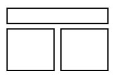
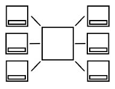
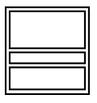
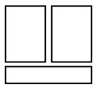
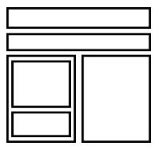

# test_landing_"levelUp"_vanilla_js

https://vlad-coder-678.github.io/test_levelUp/

Сверстать адаптивный для любых устройств лендинг, состоящий из 5 блоков. Красиво оформить его с помощью css. 

Название продукта: “LevelUp”. Продукт для повышения потенции.
Все материалы в директории облака.

Тексты и описания не имеют значения, можно использовать рыбу. 
Ссылку на директорию с выполненным заданием в git скинуть в ответ на hh.

1 Блок. Промо

Название продукта. Ниже фото продукта и 3 его характеристики в виде списка. Фон блока: произвольный видеоролик. Кнопка заказать (должна скроллить к форме заказа)

2 Блок. Состав продукта

По центру фото продукта, по бокам в столбик по 3 ингредиента (кружок внутри с картинкой) и надписью рядом. Фон: произвольный градиент или паттерн. Кнопка заказать (должна скроллить к форме заказа)

3 Блок. Отзывы

Карусель из трех элементов (отзывов). Каждый элемент должен состоять из фото, имени человека, оставившего отзыв, и текста отзыва. Фон: произвольный градиент или паттерн.

4 Блок. Промо

Фото человека с продуктом (заменить продукт на картинке). Небольшое описание продукта. Ниже 3 характеристики продукта в виде списка в линию. Фон: произвольный градиент или паттерн. Кнопка заказать (должна скроллить к форме заказа)

5 Блок. Форма заказа.

Название продукта. Таймер обратного отсчета(30 мин), фото продукта, старая и новая цена, форма заказа с именем, телефоном и кнопкой. Фон: произвольный градиент или паттерн.

Старая цена должна быть меньше и зачеркнута. Новой цене добавить произвольную css анимацию.
При селекте инпутов в форме в правом верхнем углу инпутов должны отображаться подсказки с примером имени и телефона.
В инпуте телефона разрешить ввод только цифр (без маски).

